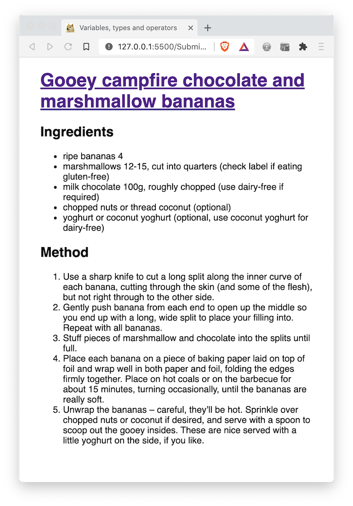
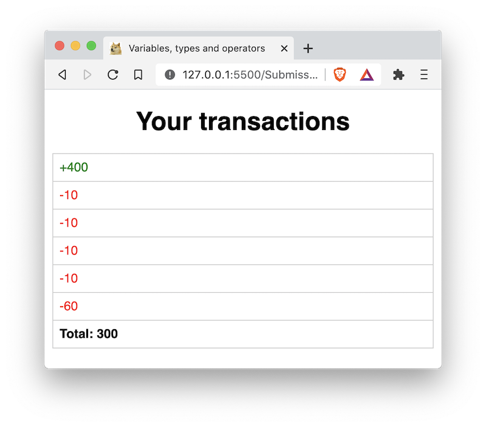
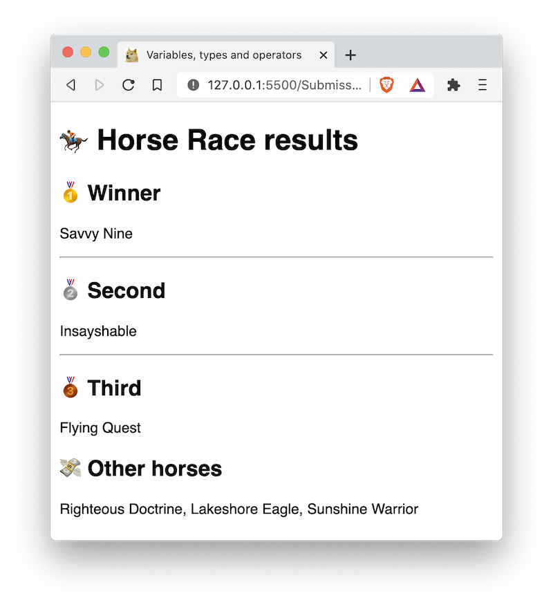
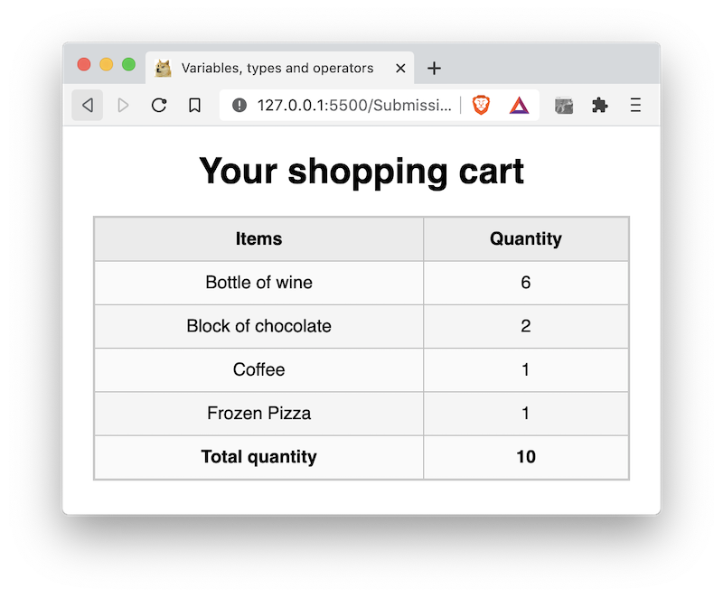

# 01 Exercise - Arrays

## Brief

Use JavaScript arrays to populate the data for a series of small web pages.

<details>
  <summary>Part A: Recipe</summary>
  <br>



</details>

<details>
  <summary>Part B: Bank Transactions</summary>
  <br>



</details>

<details>
  <summary>Part C: Horse Race Results</summary>
  <br>



</details>

<details>
  <summary>Part D: Shopping Cart</summary>
  <br>



</details>

## Rationale

Practice declaring and reading JavaScript arrays. This will build muscle memory and familiarises you with the terms used when describing arrays.

## Getting started

1. Clone this exercise to your computer
2. Open `/Submission/static/js/script.js` in VS Code. You will complete each part below in this file.

## Instructions Part A - Recipe

1. Open `Submission/recipe.html` in your browser using Live Server. You **do not** need to open this file in VS Code.
2. Complete the instructions for the `Part A: Recipe` section of the exercise

**Acceptance criteria**

- Your web page matches the screenshot in the brief

## Instructions Part B - Bank Transactions

1. Open `Submission/bank-transactions.html` in your browser using Live Server. You **do not** need to open this file in VS Code.
2. Complete the instructions for the `Part B: Bank Transactions` section of the exercise

**Acceptance criteria**

- Your web page matches the screenshot in the brief

## Instructions Part C - Race Results

1. Open `Submission/race-results.html` in your browser using Live Server. You **do not** need to open this file in VS Code.
2. Complete the instructions for the `Part C: Race Results` section of the exercise

**Acceptance criteria**

- Your web page matches the screenshot in the brief

## Instructions Part D - Shopping Cart

1. Open `Submission/shopping-cart.html` in your browser using Live Server. You **do not** need to open this file in VS Code.
2. Complete the instructions for the `Part D: Shopping Cart` section of the exercise

**Acceptance criteria**

- Your web page matches the screenshot in the brief

---

## Automated tests

<details>
  <summary>Running automated tests on your computer</summary>
  <br>

This exercise contains tests that check your code is correct. If you want to run the tests yourself, you can type the following into your terminal:

Use the following command once. This will install all the required dependencies to run the tests:

```shell
npm install
```

You can then run the test command as many times as you like. You can run tests that check you have met the acceptance criteria for a single part. For example, the below tests that Part A is complete:

```shell
npm run test:acceptance:a
```

Or you can also run tests for all the parts:

```shell
npm run test:acceptance:all
```

You can also check you have completed everything required for submission. This will test the acceptance criteria, and that [feedback.md](feedback.md) is complete.

```shell
npm test
```

</details>

---

# Submit your Exercise

- [ ] Commits are pushed to GitHub
- [ ] Automated tests pass in GitHub

---

## Exercise answer walkthrough

- [Arrays exercise walkthrough](https://www.loom.com/share/65ef968bc6474c36818774a6fe77ccf1)
